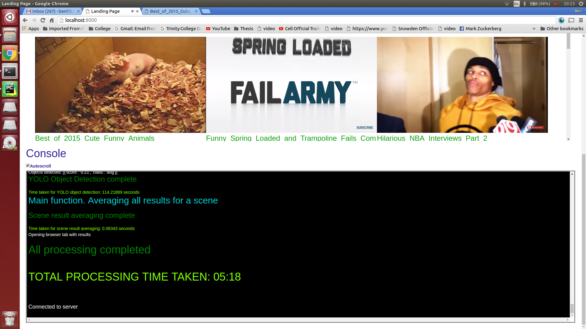

#VideoUnderstanding
 
My attempt at making computers "understand" videos. I started my code with Andrej Karpathy's Image Captioning model NeuralTalk [NeuralTalk](https://github.com/karpathy/neuraltalk) but ended up doing something else due to open-world captioning performance issues.  

This was my Computer Vision undergraduate thesis applying Faster RCNN+YOLO+Scene Classification+Scene splitting+scene change detection with results all displayed in fancy Flask web app with sockets and much more. Kenneth Dawson-Howe was my supervisor. Images below showing the web app:

Landing Page showing previously chosen and processed YouTube videos with "TV room" effect. Any YouTube video could be selected but collage videos provided the best results for scene change detection.
  

Console showing print commands in the underlying Flask server sent over a sockets interface 
  
  

Actual results page for a specific video. Horizontal scroll and general information about video
  

Showing scene results aggregated from frames within scene. 
  

Faster R-CNN and YOLO were used to detect specific objects in each frame
  

K-means, average colour were computed for each frame and chi-distance between consecutive frame histograms was computed to calculate scene change detection
  
  
